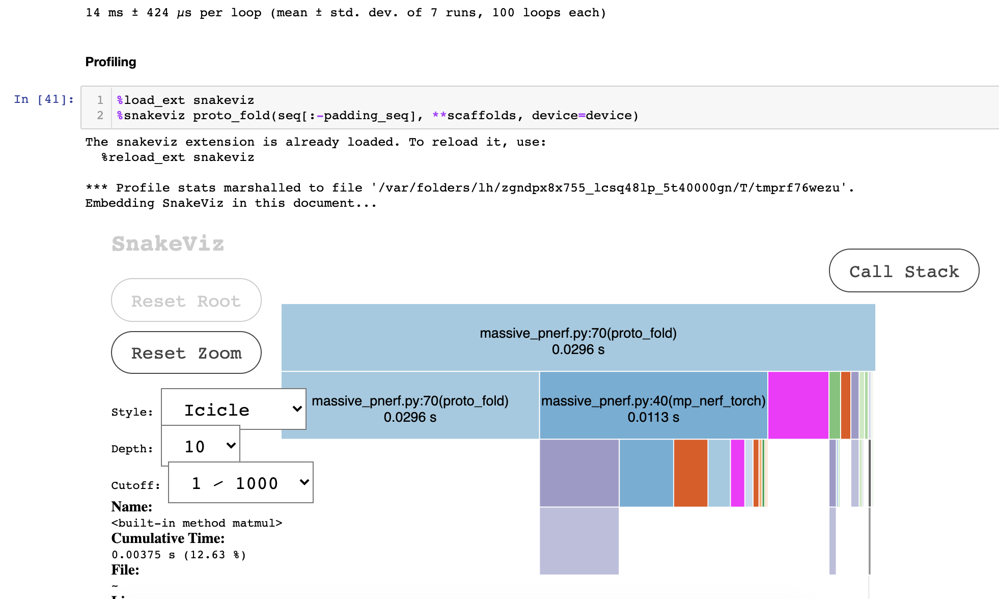
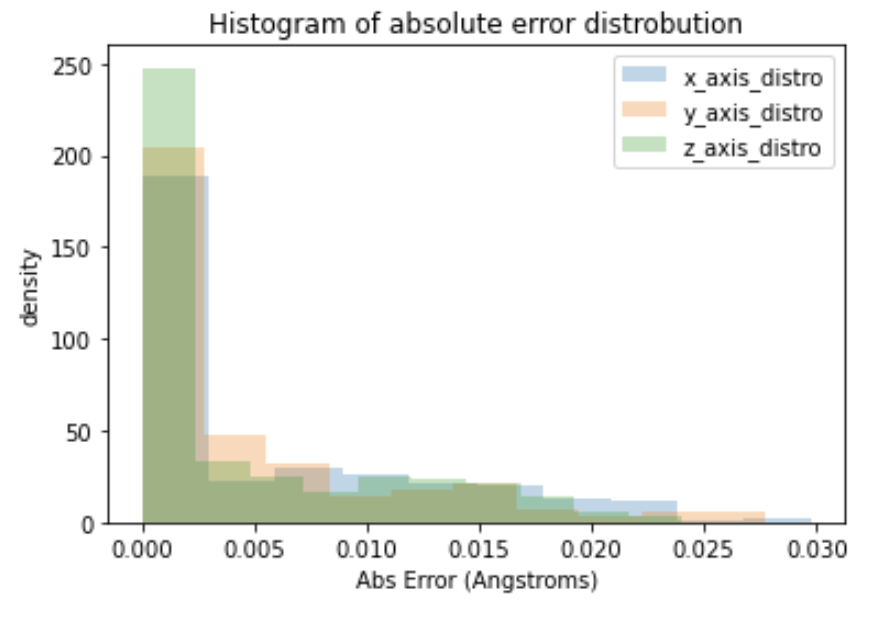
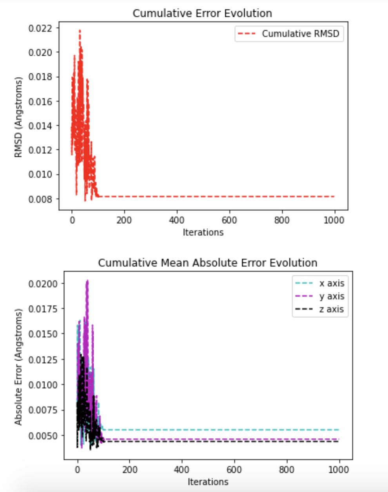

# MP-NeRF: Massively Parallel Natural Extension of Reference Frame

This is the code for the paper "[MP-NeRF: A Massively Parallel Method for Accelerating Protein Structure Reconstruction from Internal Coordinates](https://www.biorxiv.org/content/10.1101/2021.06.08.446214v1)"

The code can be installed via `pip` with 

```bash
$ pip install mp-nerf 
``` 

## Abstract

The conversion of polymers between internal and cartesian coordinates is a limiting step in many pipelines, such as molecular dynamics simulations and training of machine learning models. This conversion is typically carried out by sequential or parallel applications of the Natural extension of Reference Frame (NeRF)algorithm. 

This work proposes a massively parallel NeRF implementation, which, depending on the polymer length, achieves speedups between 400-1200x over the most recent parallel NeRF implementation by dviding the conversion into three main phases: a parallel composition of the minimal repeated structure, the assembly of backbone subunits and the parallel elongation of sidechains. 

Special emphasis is placed on reusability and ease of use within diverse pipelines. We open source the code (available at https://github.com/EleutherAI/mp_nerf) and provide a corresponding python package.


## Results: 

* **Tests**: in an intel i5 @ 2.4 ghz (cpu) and (intel i7-6700k @ 4GHz + Nvidia 1060GTX 6gb) (gpu)

length   |  sota  | **us (cpu)** |  Nx   | us (gpu) | us (hybrid) |
---------|--------|--------------|-------|----------|-------------|
~114     | 2.4s   | **5.3ms**    | ~446  | 21.1ms   | 18.9ms      |
~300     | 3.5s   | **8.5ms**    | ~400  | 26.2ms   | 22.3ms      |
~500     | 7.5s   | **9.1ms**    | ~651  | 29.2ms   | 26.3ms      |
~1000    | 18.66s | **15.3ms**   | ~1200 | 43.3ms   | 30.1ms      |

* **Profiler Trace (CPU)**:
<center></center>
<center></center>
<center></center>

#### Considerations

* In the GPU algo, much of the time is spent in the data transfers / loop in the GPU is very inefficient. 
* about 1/2 of time is spent in memory-access patterns and the sequential `for loop`, so ideally 2x from here would be possible by optimizing it or running the sequential loop in cython / numba / whatever
* total profiler time should be multiplied by 0.63-0.5 to see real time (see execution above without profiler). Profiling slows down the code.


## Installation:

Just clone the repo

You'll need:
* torch > 1.6
* numpy
* einops

Plus, if you want to run the experiments / work with data: 
* joblib
* sidechainnet: https://github.com/jonathanking/sidechainnet#installation
* manually install `ProDY`, `py3Dmol`, `snakeviz`:
	* `pip install proDy`
	* `pip install py3Dmol`
	* `pip install snakeviz`
	* any other package: `pip install package_name`


* matplotlib (to do diagnostic plots)

## Citations:

```bibtex
@article{Parsons2005PracticalCF,
    title={Practical conversion from torsion space to Cartesian space for in silico protein synthesis},
    author={Jerod Parsons and J. B. Holmes and J. M. Rojas and J. Tsai and C. Strauss},
    journal={Journal of Computational Chemistry},
    year={2005},
    volume={26}
}
```

```bibtex
@article{AlQuraishi2018pNeRFPC,
    title={pNeRF: Parallelized Conversion from Internal to Cartesian Coordinates},
    author={Mohammed AlQuraishi},
    journal={bioRxiv},
    year={2018}
}
```

```bibtex
@article{Bayati2020HighperformanceTO,
    title={High‐performance transformation of protein structure representation from internal to Cartesian coordinates},
    author={M. Bayati and M. Leeser and J. Bardhan},
    journal={Journal of Computational Chemistry},
    year={2020},
    volume={41},
    pages={2104 - 2114}
}
```

