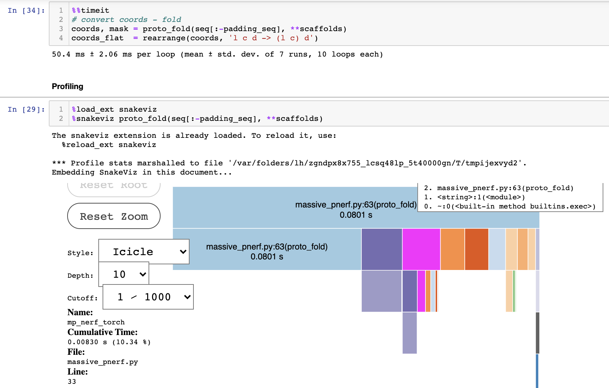

# MP-NeRF: Massively Parallel Natural Extension of Reference Frame

## TL;DR

* **NeRF** is a method for finding the 4th point in a polymer (ex: abcd) given the previous 3 points (ex: abc), the angle (bcd) and the dihedral angle (abc - bcd).

* The current implementations fold polymers in sequence (ex: for a protein it would be: N-CA-C-O-CB-side_chain_1-N-CA-C-O-CB-side_chain_2...N-CA-C-O-CB-side_chain_n)

* Since AAs in proteins are only linked by the backbone (N-CA-C-N-CA-C-...) what we do is to fold the backbone in 3 parallel passes (1 for N, for CA and for C). Then we link all those fragments into 1 chain (the sequential pass) and then we build all the sidechains in parallel + the Oxygen in the carbonyl group.

* This allows for great speedups since many cross-products, normalizations, rotations, ... can be parallelized in CPU or in GPU.
The current speedup is about 100x against the SoTA that was published in July, 2020. 

**Some related info**:
* original NERF paper from 2005: http://www.entsphere.com/pub/pdf/Practical%20conversion%20from%20torsion%20space%20to%20cartesian%20space%20for%20in%20silico%20protein%20synthesis.pdf
* what is the protein backbone: https://www.google.com/search?q=protein+backbone+dihedral&sxsrf=ALeKk02Aud_zF4Aq-uhV4SpGTi-IhU6Inw:1613231813413&source=lnms&tbm=isch&sa=X&ved=2ahUKEwiHw7bpnOfuAhUYaRUIHa7EC0kQ_AUoAXoECAoQAw&biw=1354&bih=842
* previous sota (some of their figures illustrate their algo): https://www.researchgate.net/publication/343073419_High-performance_transformation_of_protein_structure_representation_from_internal_to_Cartesian_coordinates
* another parallel NeRF implementation from 2019 that does it fragment-wise: https://github.com/aqlaboratory/pnerf (we take the fragment concept to the extreme and do it for every aa and for all the side chains. also we use pytorch instead of TF).
* we load the data from and make heavy use of the format provided in this repo: https://github.com/jonathanking/sidechainnet

## Results: 
* On a 330 AA protein:

Considerations:
* Only CPU execution (i'll run gpu tests later today)
* actual algorithm is about 1/3 of time: sum(mp_nerf_torch, norm, matmul, ..)
* about 1/2 of time is spent in memory-access patterns, so ideally 2x from here would be possible by optimizing it
* total profiler time should be multiplied by 0.63 to see real time (see execution above without profiler). Profiling slows down the code.

## Installation:

Just clone the repo

You'll need:
* torch > 1.6
* numpy
* einops
* joblib
* sidechainnet: https://github.com/jonathanking/sidechainnet#installation
* manually install `ProDY`, `py3Dmol`, `snakeviz`:
	* `pip install proDy`
	* `pip install py3Dmol`
	* `pip install snakeviz`
	* any other package: `pip install package_name`

* matplotlib (to do diagnostic plots)

